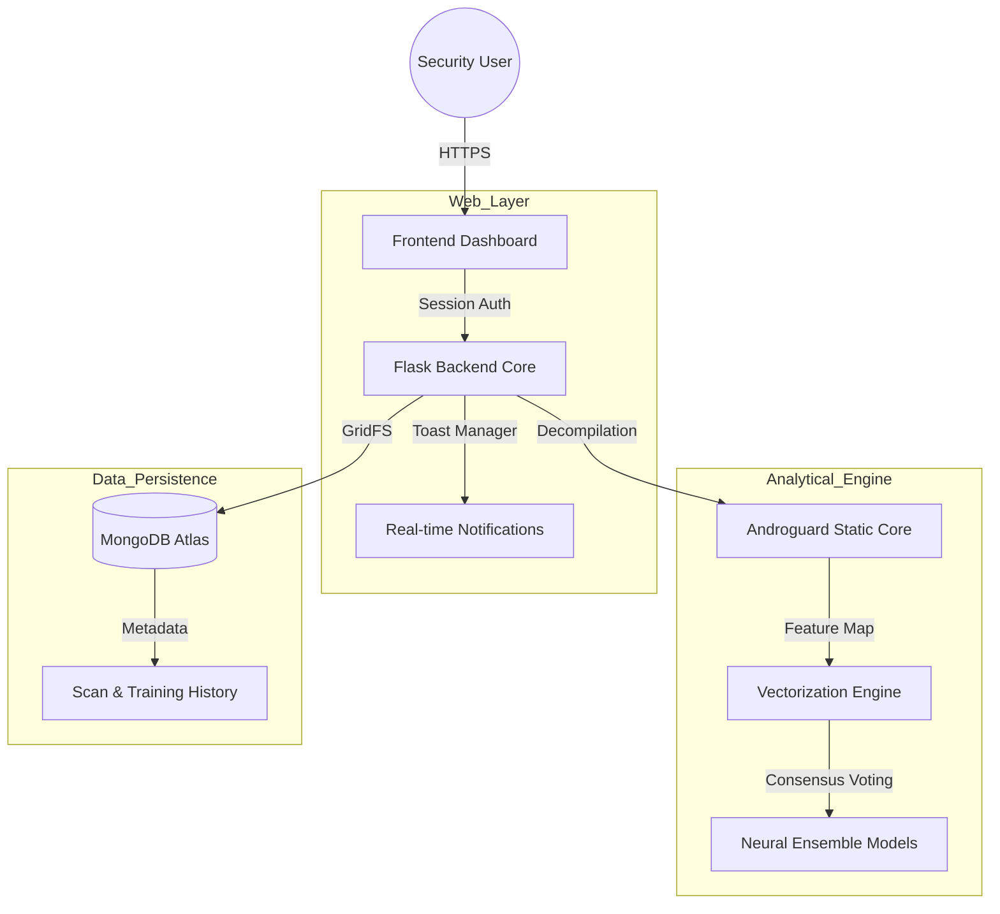
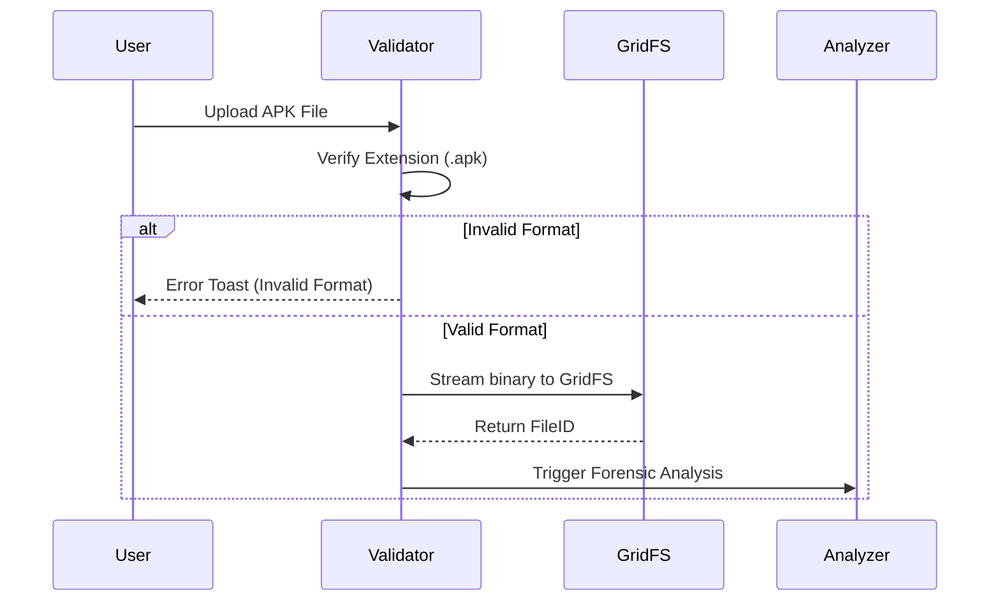
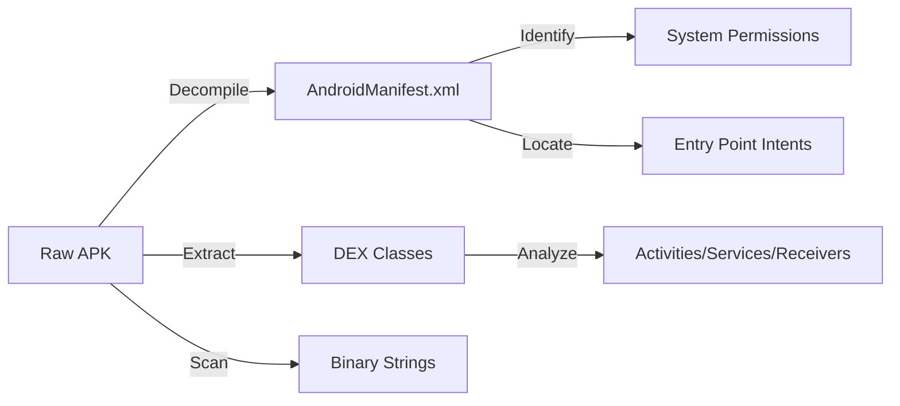
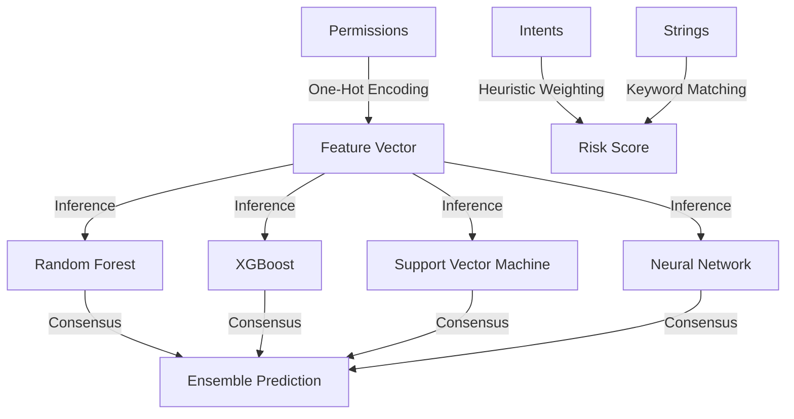
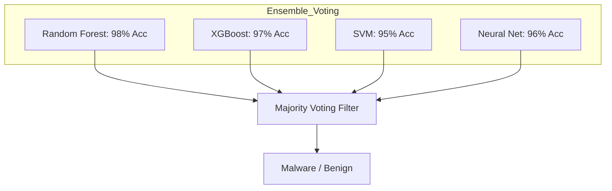
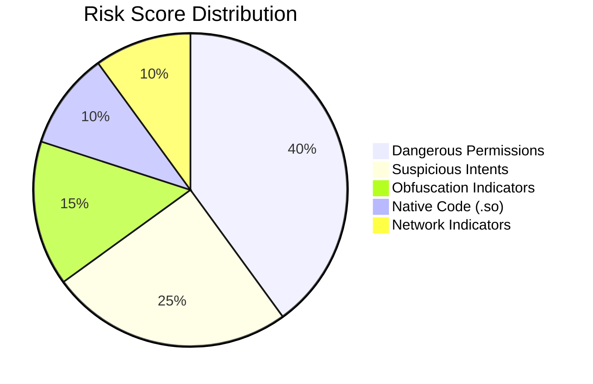
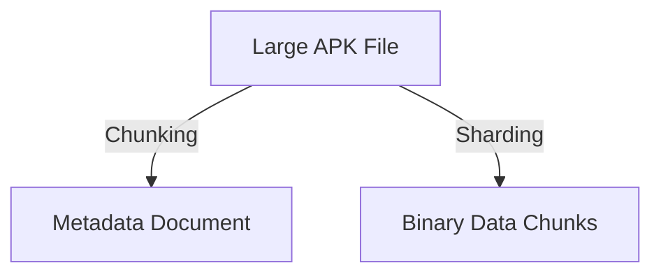
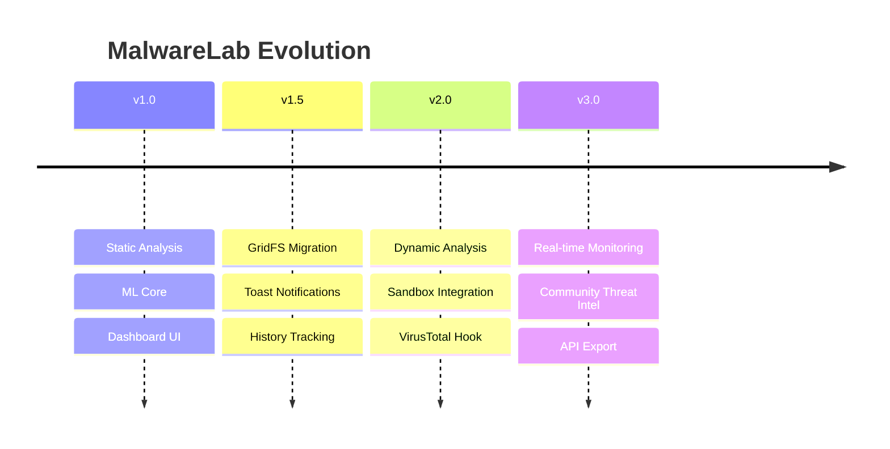

# MalwareLab: Advanced AI-Powered Malware Forensic Platform

## Project Overview
MalwareLab is a high-performance, enterprise-grade forensic platform designed to detect and analyze Android malware using a hybrid approach of Static Analysis and Neural Ensemble Learning. The platform provides end-to-end transparency, moving from raw file ingestion to explainable forensic intelligence, enabling security researchers and students to understand the exact behavioral DNA of a threat.

---

## 1. High-Level System Architecture
The platform is built on a modular micro-service architecture that separates the UI orchestration from the heavy analytical core.

---

## 2. End-to-End User Journey: The Story of a Scan
The platform follows a rigorous sequence to ensure data integrity and detection accuracy.

### Phase 1: Ingestion and Validation
When a user uploads an APK, the system performs immediate format validation and secure storage routing.

### Phase 2: Static Forensic Extraction
The backend decompiles the binary into a readable manifest and code structure.

---

## 3. The Machine Learning Core
MalwareLab uses a sophisticated ensemble of AI models to ensure that the detection is not dependent on a single algorithm.

### Feature Engineering Pipeline

### Model Consensus Strategy
The final prediction is a weighted result of multiple independent classifiers.

---

## 4. Deep Forensic Intelligence (The Report)
The platform generates a multi-dimensional report that explains the "Why" behind the "What".

### Risk Factor Weighting
Each security red flag contributes to a cumulative Risk Score.

### Forensic Report Components
| Component | Description | Educational Value |
| :--- | :--- | :--- |
| **Risk Radar** | Visualizes threat vectors across 5 dimensions. | Understands threat surface. |
| **Permission Audit** | Splits allowed vs. dangerous permissions. | Identifies over-privileged apps. |
| **Intel Items** | Highlights specific malicious strings or IPs. | Connects code to behavior. |
| **Workflow Diagram** | Explains the step-by-step AI logic. | Demystifies Machine Learning. |

---

## 5. Security and Data Hardening
The platform is designed with production-grade security standards.

### Authentication Flow

### Storage Strategy: GridFS
By using MongoDB GridFS, large APK files are broken into 255KB chunks, allowing for efficient streaming and preventing memory overflows during large-scale analysis.

---

## 6. Development Roadmap
Future enhancements focus on deepening the forensic capabilities.

---

## 7. Installation and Setup
To deploy MalwareLab, ensure you have a Python 3.8+ environment and a MongoDB instance (Local or Atlas).

### Required Dependencies
*   **Flask**: Web Orchestration
*   **PyMongo**: Database Interface
*   **Androguard**: Forensic Decompilation
*   **Scikit-Learn / Pandas**: Machine Learning Operations
*   **Bcrypt**: Security Hashing

### Local Deployment
1. Configure environment variables in `.env`.
2. Initialize virtual environment: `python -m venv .venv`.
3. Install dependencies: `pip install -r requirements.txt`.
4. Launch application: `python app.py`.

---

## 8. Technical Conclusion
MalwareLab serves as a bridge between complex cybersecurity forensics and explainable artificial intelligence. By providing a transparent analysis pipeline, it enables users to not only detect threats but to understand the fundamental mechanisms of modern mobile malware.
