# MalwareLab: Enterprise-Grade AI Malware Forensic Platform

## 1. Executive Summary & Project Vision

MalwareLab represents a paradigm shift in mobile security forensics. Moving beyond simple signature-based antivirus solutions, this platform leverages a hybrid architecture combining deep static analysis with a multi-model Artificial Intelligence ensemble. Designed for both seasoned security researchers and educational purposes, MalwareLab provides an end-to-end, transparent view into the "DNA" of Android applications. 

The core mission is **Explainable Threat Intelligence**. Every prediction is backed by transparent data, breaking down complex machine learning mathematics into readable, actionable insights through a secure, high-performance web dashboard.

---

## 2. Comprehensive System Architecture

The platform operates on a modernized micro-services paradigm, ensuring separation of concerns between user interfacing, data persistence, and heavy analytical processing.

### 2.1 Top-Level Architecture
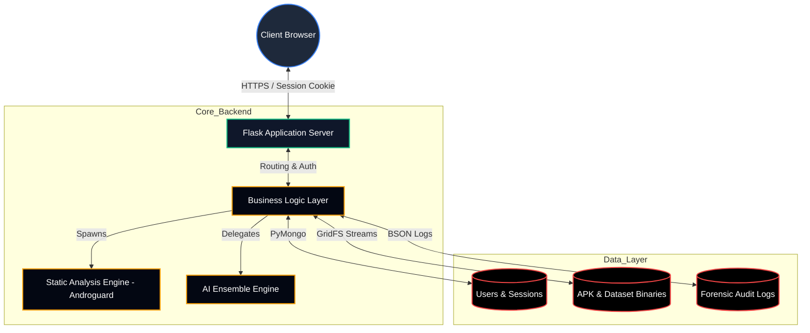
**Architecture Explained:** This blueprint shows how all the pieces of MalwareLab fit together. Think of it like a restaurant: the Client Browser is the customer ordering from the menu, the WebServer is the waiter taking the order, the LogicController is the kitchen manager, and the Databases are the pantry where ingredients are stored. The Analysis Engine and AI Core act as the chefs who prepare the final dish (the security report). By separating these roles, the system remains fast, stable, and highly secure.

### 2.2 Security Boundary & Trust Zones
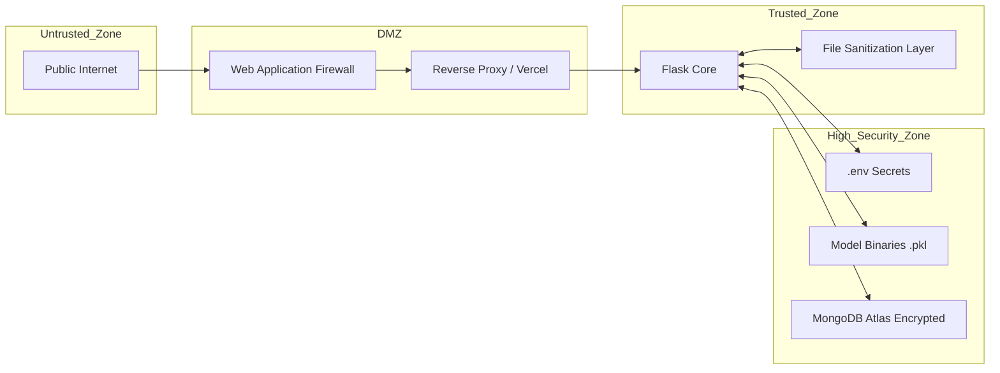
**Security Zones Explained:** Security is about building walls. This diagram illustrates the layers of defense protecting our core system. The public internet is untrusted, so requests first pass through a firewall (the DMZ). Once inside, the Flask application sanitizes the incoming data before it's allowed anywhere near the "High Security Zone." This inner vault acts as an impenetrable fortress holding our cryptographic keys, user database records, and the sensitive AI brain.

---

## 3. User Journey Map & Onboarding Flows

The platform employs a strict authentication gateway. All forensic tools require a verified user session to maintain an immutable audit trail of scans and training activities.

### 3.1 Global Application State Machine
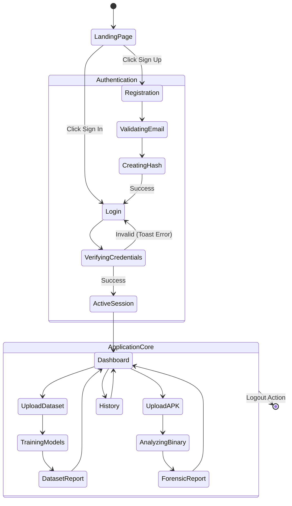
**User Journey Explained:** This is the master roadmap of the user experience. It maps out every single screen you can visit and exactly how they connect. From the moment you land on the homepage, you are guided through a secure registration or login process. Once authenticated, the dashboard opens up, allowing you to branch off into uploading datasets, analyzing suspicious APK files, or reviewing your past history, before safely terminating your session.

### 3.2 The Registration Sequence
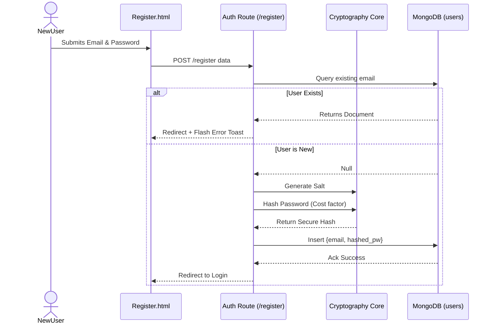
**Registration Explained:** When a new user signs up, we guarantee that we never store their password directly. This sequence shows how the system takes your plaintext password and passes it through a heavy cryptographic mixer called 'Bcrypt'. It turns your password into an unrecognizable, salted string of characters (a hash) before saving it to the database, ensuring that even in the worst-case scenario of a database breach, your actual password remains completely safe.

### 3.3 The Login & Session Management Sequence
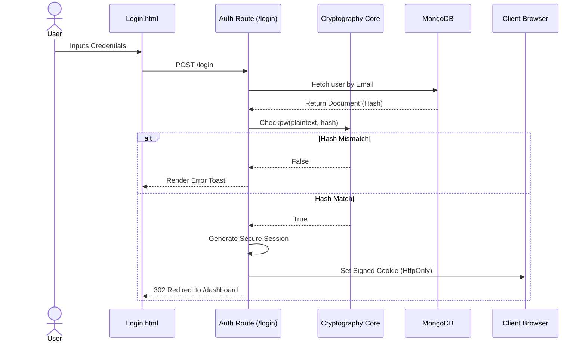
**Login Flow Explained:** Logging in isn't just about checking a password; it's about establishing trust. When you enter your credentials, the system compares the mathematical hash of what you typed against what is stored. If they match perfectly, the server hands your browser a "Secure Session Cookie"—a digital, cryptographically signed ID badge that lets you move freely around the secure dashboard without needing to log in again for every single click.

---

## 4. The Core Operations Ecosystem (Dashboard)

The Dashboard is the command center. It acts as a routing hub for the two primary functional paths: Model Training and APK Analysis.

### 4.1 Dashboard UI Component Breakdown
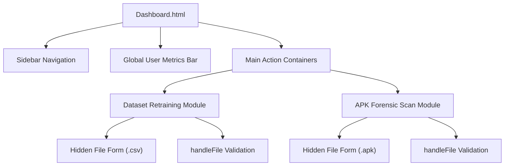
**Dashboard Anatomy Explained:** The Dashboard is your centralized command center. This diagram breaks down its anatomy into logical pieces. On the left, the sidebar helps you navigate, while the top bar displays global metrics. The center stage is split into two primary action panels: one dedicated to training the AI with new datasets, and one for uploading and analyzing suspicious APK files. Each panel features hidden layers of validation to protect the server from bad inputs.

### 4.2 Client-Side File Validation Pipeline

**Validation Pipeline Explained:** Before you even click upload, the system is already working to protect the server. This flow shows how your web browser acts as a bouncer at the door. If you accidentally try to upload a music file or an image instead of an APK or CSV, the JavaScript instantly blocks it and shows a helpful toast error message. This saves time, conserves bandwidth, and ensures the backend remains focused entirely on legitimate security analysis.

---

## 5. Use Case I: Machine Learning Pipeline (Dataset Training)

The platform is not static. It allows administrators to upload new intelligence datasets (CSV) to continuously retrain the AI models, adapting to zero-day threats.

### 5.1 Training Request Workflow
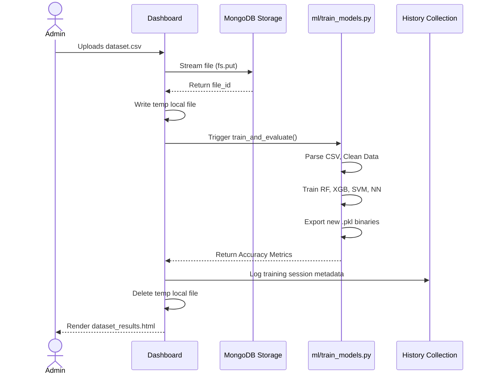
**Training Workflow Explained:** Teaching an AI requires careful steps and data hygiene. When you upload a new dataset, it is securely streamed directly into the database. The system then takes a temporary working copy, scrubs the data, and runs it through four complex machine learning algorithms. It figures out which algorithm is the smartest, saves that "brain" for future scans, records the accuracy in the history logs, and finally presents you with a success report.

### 5.2 Feature Engineering & Model Training Detail
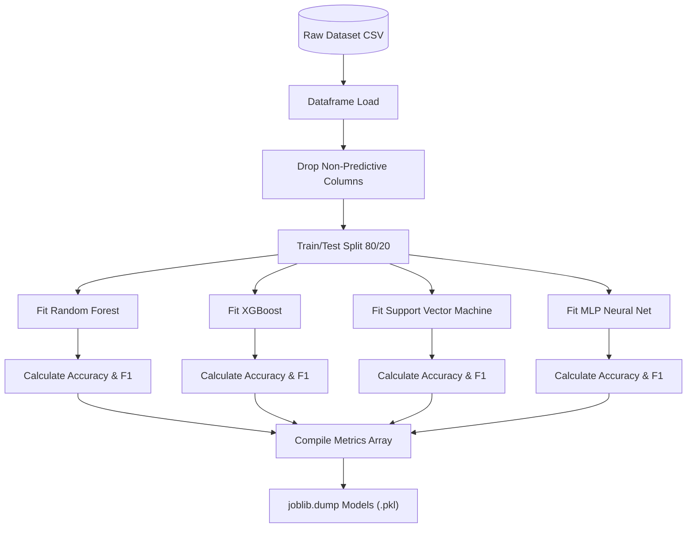
**Model Training Explained:** This is how raw data is transformed into Artificial Intelligence. The system takes a massive spreadsheet of known malware characteristics, removes any useless information, and splits the data into a "study guide" (training) and a "final exam" (testing). It trains four different mathematical models using the study guide, tests them on the exam to gauge their accuracy, and saves the most capable models to disk so they are ready to protect the system.

---

## 6. Use Case II: Deep Forensic Malware Detection

This is the primary engine of the platform. It takes an unknown binary, dissects it without execution, extracts features, and runs them through a consensus algorithm.

### 6.1 The Master Analysis Pipeline
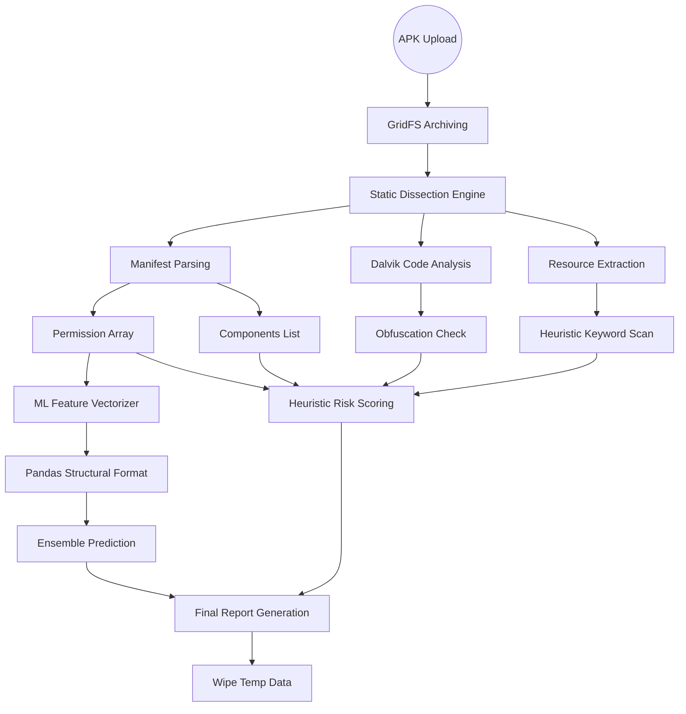
**Analysis Pipeline Explained:** This is the absolute heart of MalwareLab. When a suspicious app is uploaded, we don't install it; we take it apart like a forensic mechanic inspecting an engine. The Static Engine reads the code, extracts the permissions and hidden strings, and passes them to two different judges: the AI Engine (which looks for complex, hidden patterns) and the Heuristic Risk Engine (which looks for obvious red flags). They combine their findings into one master report.

### 6.2 Permission Extraction & Categorization Logic
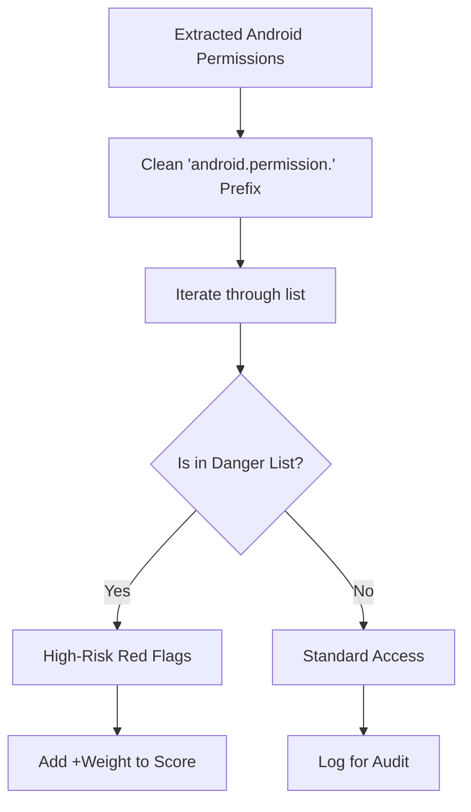
**Permission Categorization Explained:** Every Android application asks for permissions (like accessing your camera or your text messages). This system automatically filters out the boring, standard permissions and shines a harsh spotlight on the dangerous ones. It separates them into two distinct buckets: "High-Risk Red Flags" that count heavily against the app's safety score, and "Standard Access" which is simply logged for your peace of mind and transparency.

### 6.3 The Heuristic Risk Scoring Algorithm
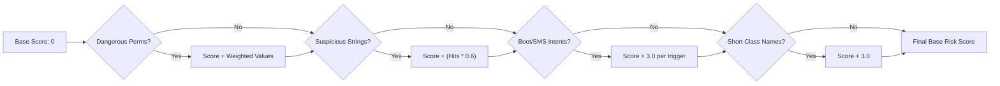
**Risk Scoring Explained:** Think of this as a strict, unforgiving security checklist. The system starts with a perfect score of zero. As it scans the app, it adds penalty points for every shady thing it uncovers. Asking for dangerous permissions adds points. Containing hidden hacker strings adds points. Trying to hide its code (obfuscation) adds points. The higher the final combined score, the closer the application gets to an 'F' security grade.

### 6.4 The Neural Ensemble Inference Protocol
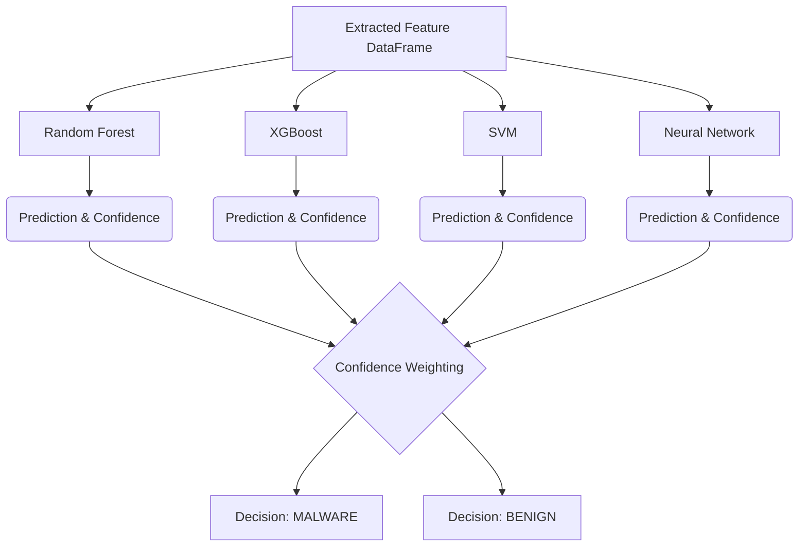
**Ensemble Inference Explained:** Why trust one AI when you can rely on the consensus of four? This diagram shows our advanced "Ensemble" approach. The extracted data is fed into four separate artificial brains simultaneously. Each brain analyzes the app independently and casts a vote. An automated arbiter looks at all the votes and their respective confidence levels to make a final, highly accurate, and mathematically sound decision on whether the app is safe or malicious.

---

## 7. The Visual Intelligence Output (Forensic Report)

Once the backend completes the intensive calculations, it compiles the data into a high-level, human-readable forensic dashboard.

### 7.1 Report Rendering Data Flow
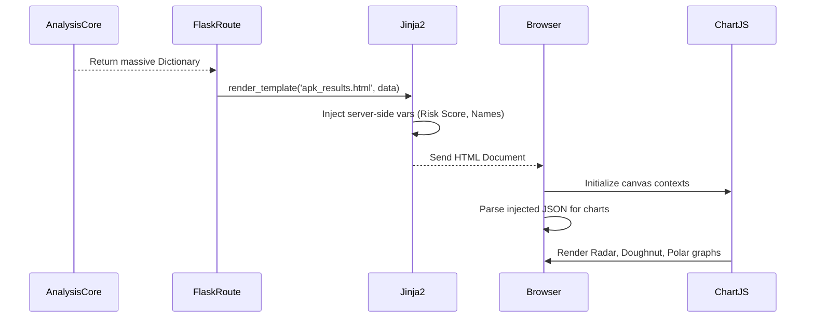
**Rendering Flow Explained:** Translating raw backend mathematics into a beautiful dashboard is a multi-step process. Once the server finishes analyzing the app, it creates a massive dictionary of intelligence data. This data is injected directly into the HTML code by the server. Finally, your web browser reads this data and uses JavaScript to draw the interactive charts and graphs, turning complex numbers into intuitive, easy-to-understand visual insights.

### 7.2 UI/UX Responsive State Machine (Print vs Screen)
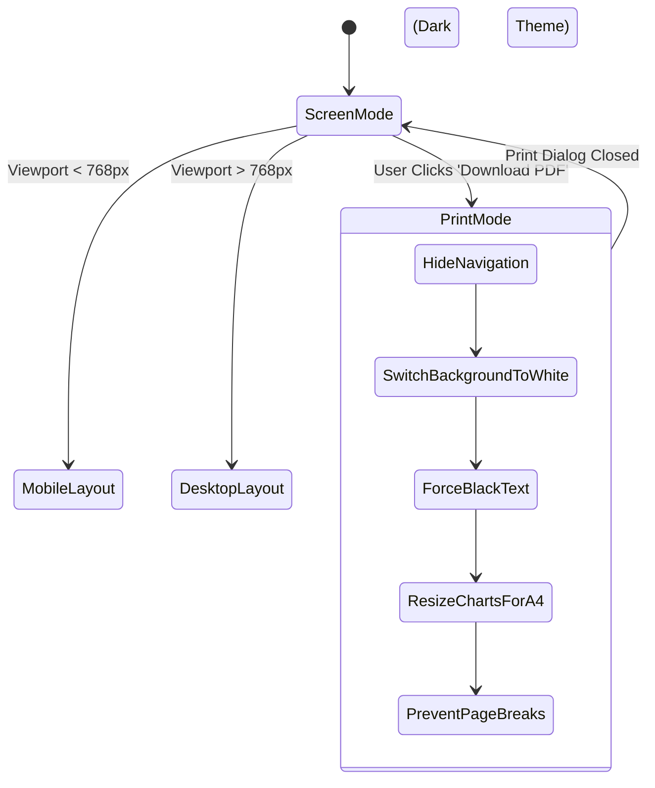
**Print Optimization Explained:** Our forensic reports are designed to live beautifully on both digital screens and physical paper. This diagram explains how the interface instantly adapts to its environment. If you click "Download PDF," the system acts as a virtual backend: it hides all the web buttons, switches to a high-contrast white background, and precisely resizes the charts so they fit perfectly on a printed A4 page without ever getting awkwardly cut in half.

---

## 8. Use Case III: Persistent Security Auditing (History Page)

The platform maintains a permanent ledger of all activities. This allows administrators to track threat trends and review past neural network training iterations.

### 8.1 Dual-Tab History Retrieval Logic
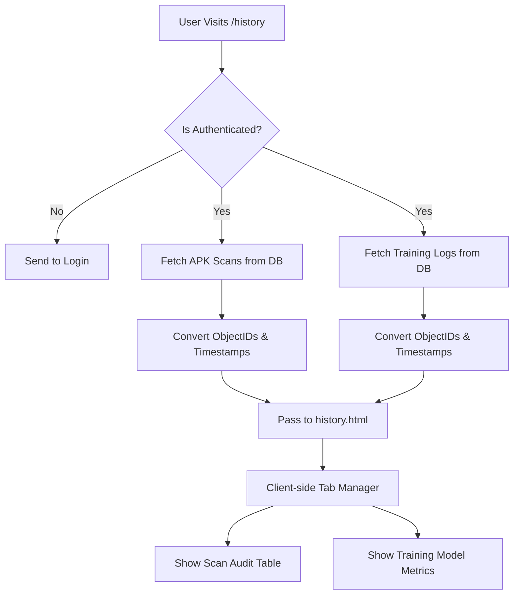
**History Logic Explained:** The History page acts as an immutable, permanent ledger of everything you have ever done on the platform. When you visit it, the system checks your session ID and then queries the database for two completely distinct lists: your past APK scans and your past AI training runs. It formats the dates and passes them to the web page, where client-side JavaScript neatly organizes them into two clickable, interactive tabs.

### 8.2 Database Schema Architecture (ERD)
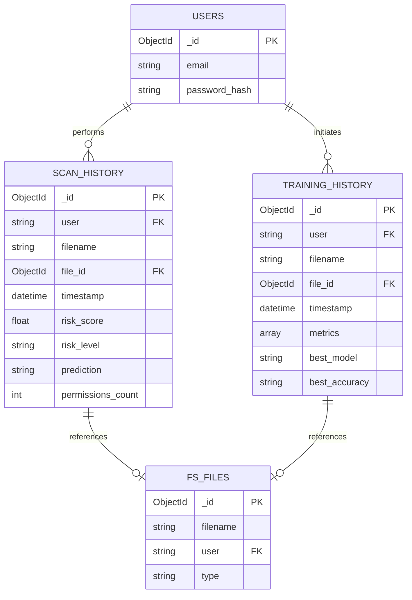
**Database ERD Explained:** This is the foundational blueprint of our data vault. It explicitly shows how pieces of information are logically linked together. Every User acts as a central hub. A user can perform many "Scan Histories" or "Training Histories." In turn, those textual history logs are permanently tied to the actual, physical files stored securely in the GridFS "FS_FILES" collection, ensuring total data integrity and preventing orphaned records.

---

## 9. Foundational Components & Infrastructure

### 9.1 Environment & Secrets Management
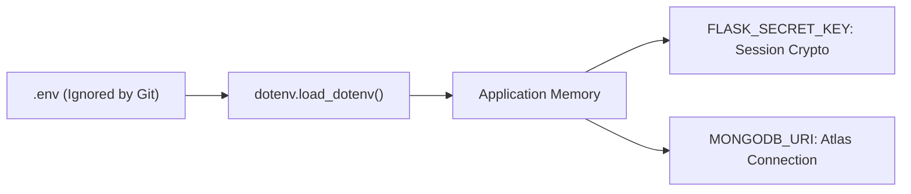
**Secrets Management Explained:** Top-tier security requires keeping secrets an absolute secret. This workflow demonstrates how the application manages critical passwords and database connection strings. Instead of dangerously writing passwords directly into the code, we hide them in an invisible `.env` file. When the server starts up, it quietly loads these secrets directly into the computer's temporary memory, ensuring hackers can never find them in the public source code repository.

### 9.2 The Toast Notification Engine
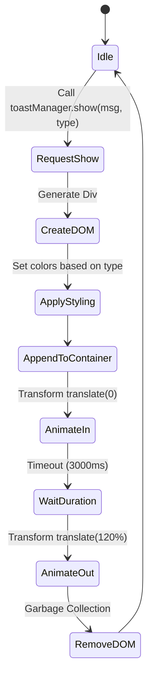
**Toast Engine Explained:** "Toasts" are those smooth, modern pop-up messages you see when you do something correctly (or incorrectly). This logic flow shows how the system dynamically creates a temporary box, colors it red or green, slides it onto the screen using CSS animations, waits exactly three seconds, and then gracefully slides it off before permanently deleting it. This provides a clean way to communicate without relying on annoying, outdated alert boxes.

---

## 10. Deployment & Technical Setup Guide

### 10.1 System Prerequisites
*   **OS**: Linux, macOS, or Windows
*   **Engine**: Python 3.8 to 3.11 (Scikit-learn compatibility)
*   **Database**: MongoDB (Local instance or Cloud Atlas cluster)
*   **Memory**: Minimum 4GB RAM (Required for in-memory model inference and APK decompression)

### 10.2 Installation Sequence

1.  **Clone the Repository**
    ```bash
    git clone https://github.com/BlueHeart-Saga/malware-detection.git
    cd malware-detection
    ```

2.  **Establish Secure Environment**
    Create a `.env` file in the root directory:
    ```ini
    FLASK_SECRET_KEY=your_cryptographically_secure_random_string
    MONGODB_URI=mongodb+srv://<username>:<password>@cluster.mongodb.net/?retryWrites=true&w=majority
    ```

3.  **Initialize Virtual Sandbox**
    ```bash
    python -m venv .venv
    source .venv/bin/activate  # On Windows: .venv\Scripts\activate
    ```

4.  **Install Core Dependencies**
    ```bash
    pip install -r requirements.txt
    ```

5.  **Bootstrap the Application**
    ```bash
    python app.py
    ```

### 10.3 Initializing the AI Core
Before running your first APK scan, the system requires a baseline intelligence model.
1. Log into the dashboard.
2. Navigate to the **Model Training** card.
3. Upload a validated CSV dataset containing malware feature vectors.
4. The system will automatically compile the `.pkl` files into the `models/` directory, activating the forensic engine.

---

> *"The only truly secure system is one that is powered off, cast in a block of concrete and sealed in a lead-lined room with armed guards. For everything else, there is Explainable Artificial Intelligence."* 
> — A modern security axiom for the predictive era.
