# MalwareLab: Enterprise-Grade AI Malware Forensic Platform

## 1. Executive Summary & Project Vision

MalwareLab represents a paradigm shift in mobile security forensics. Moving beyond simple signature-based antivirus solutions, this platform leverages a hybrid architecture combining deep static analysis with a multi-model Artificial Intelligence ensemble. Designed for both seasoned security researchers and educational purposes, MalwareLab provides an end-to-end, transparent view into the "DNA" of Android applications. 

The core mission is **Explainable Threat Intelligence**. Every prediction is backed by transparent data, breaking down complex machine learning mathematics into readable, actionable insights through a secure, high-performance web dashboard.

---

## 2. Comprehensive System Architecture

The platform operates on a modernized micro-services paradigm, ensuring separation of concerns between user interfacing, data persistence, and heavy analytical processing.

### 2.1 Top-Level Architecture
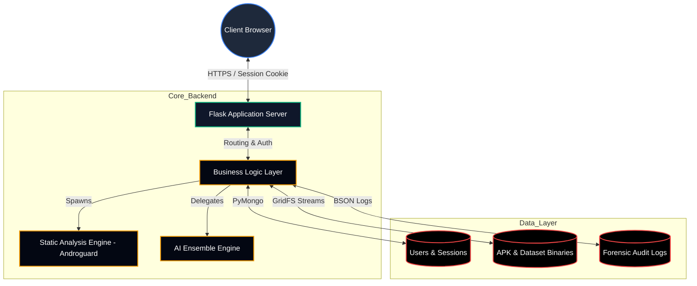

### 2.2 Security Boundary & Trust Zones
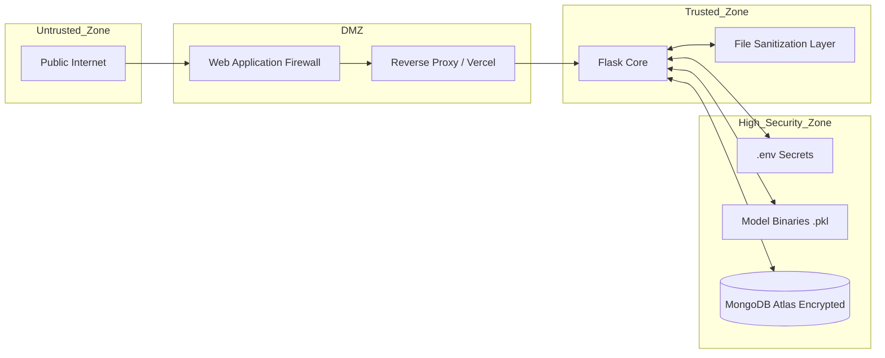

---

## 3. User Journey Map & Onboarding Flows

The platform employs a strict authentication gateway. All forensic tools require a verified user session to maintain an immutable audit trail of scans and training activities.

### 3.1 Global Application State Machine
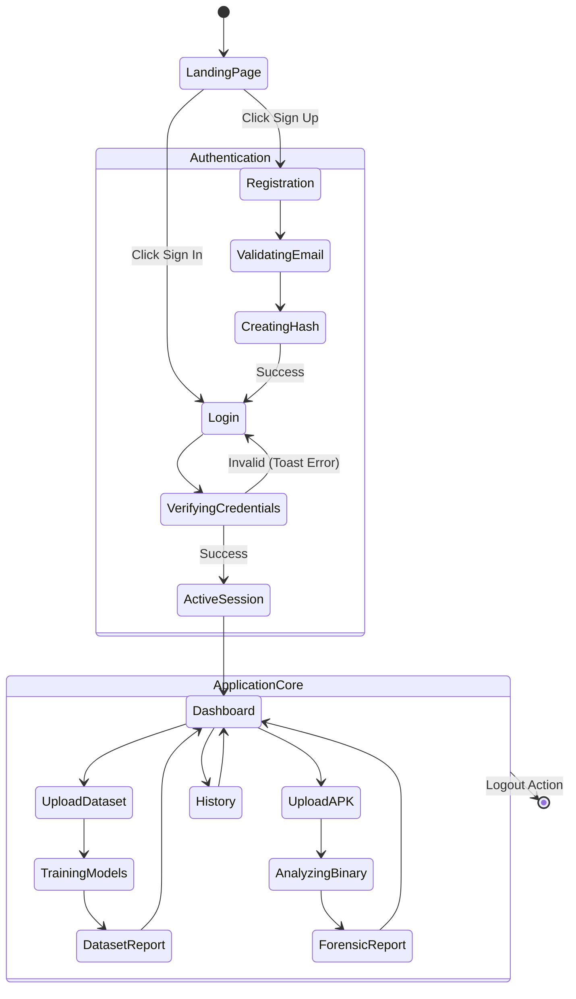

### 3.2 The Registration Sequence
Security begins at user creation. Passwords are never stored in plaintext; they undergo immediate cryptographic hashing.

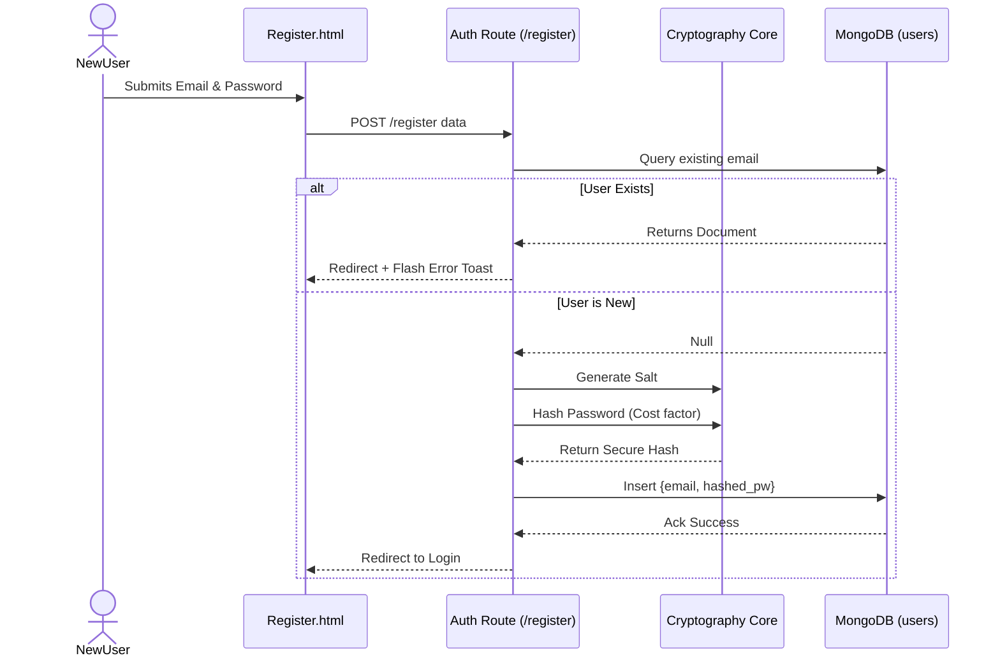

### 3.3 The Login & Session Management Sequence
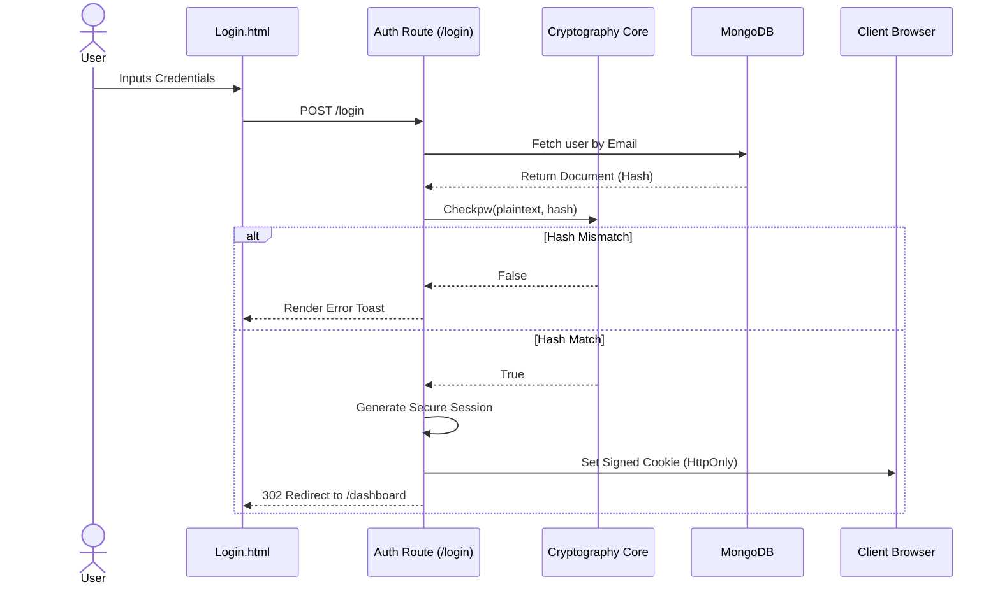

---

## 4. The Core Operations Ecosystem (Dashboard)

The Dashboard is the command center. It acts as a routing hub for the two primary functional paths: Model Training and APK Analysis.

### 4.1 Dashboard UI Component Breakdown
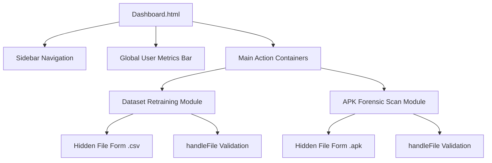

### 4.2 Client-Side File Validation Pipeline
Before a byte of data hits the server, the frontend validates the intent.

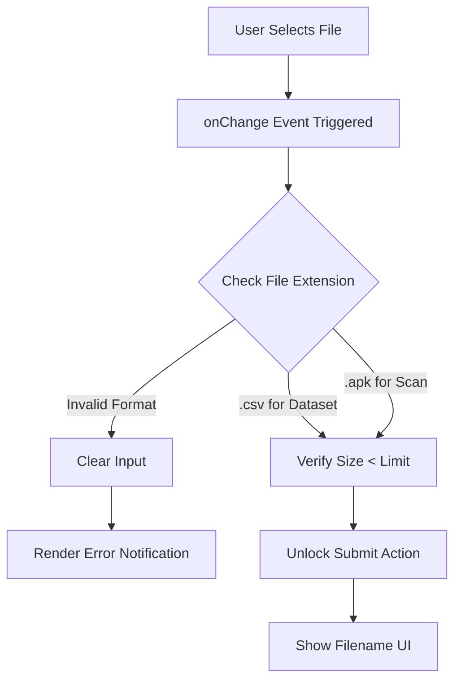

---

## 5. Use Case I: Machine Learning Pipeline (Dataset Training)

The platform is not static. It allows administrators to upload new intelligence datasets (CSV) to continuously retrain the AI models, adapting to zero-day threats.

### 5.1 Training Request Workflow
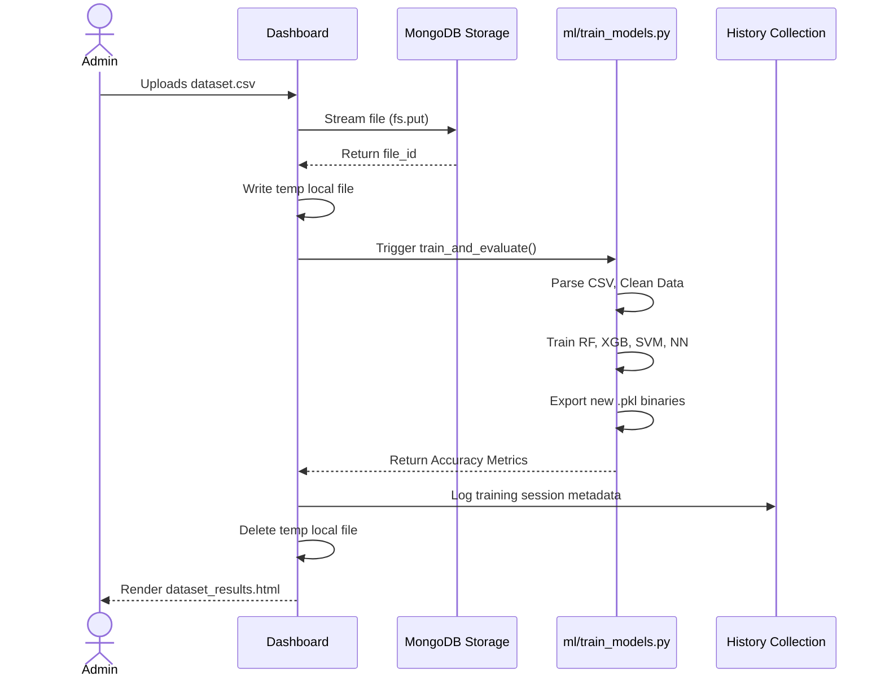

### 5.2 Feature Engineering & Model Training Detail


---

## 6. Use Case II: Deep Forensic Malware Detection

This is the primary engine of the platform. It takes an unknown binary, dissects it without execution, extracts features, and runs them through a consensus algorithm.

### 6.1 The Master Analysis Pipeline
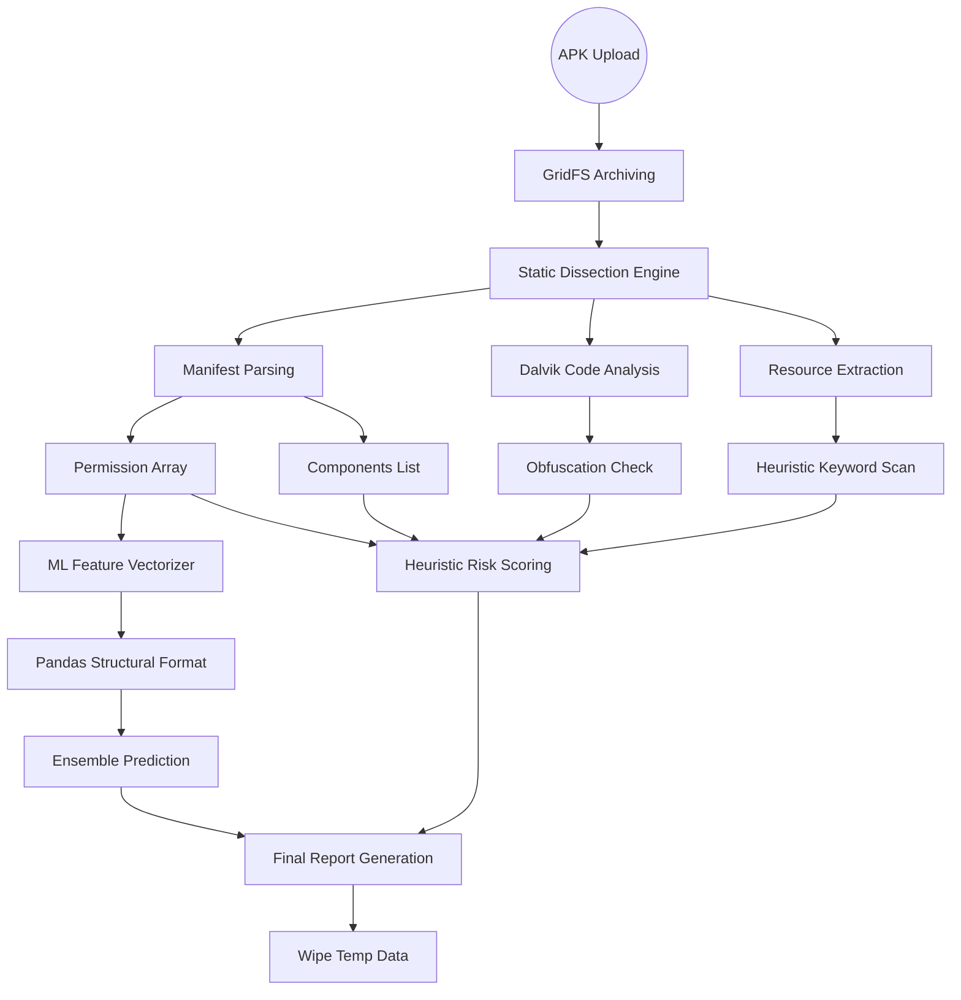

### 6.2 Permission Extraction & Categorization Logic
The system intelligently separates requested permissions into standard requirements and high-risk vectors.

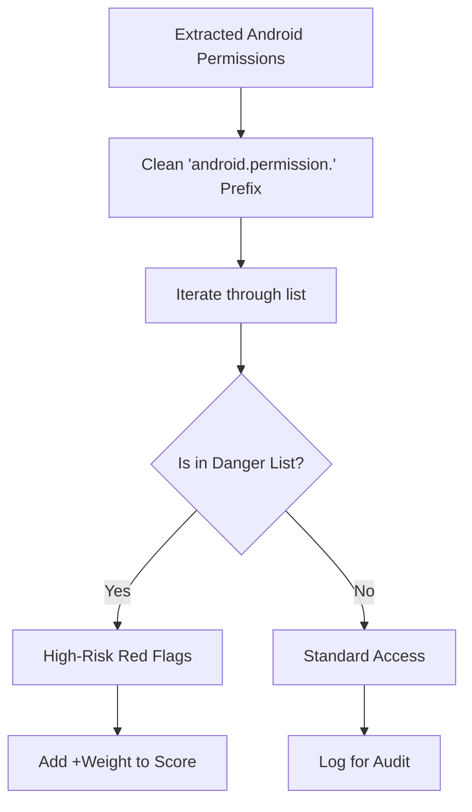

### 6.3 The Heuristic Risk Scoring Algorithm
While AI handles non-linear patterns, the heuristic engine looks for definitive red flags to establish a base risk score.

```mermaid
flowchart LR
    Start[Base Score: 0] --> PermCheck{Dangerous Perms?}
    PermCheck -- Yes --> AddPerm[Score + Weighted Values]
    PermCheck -- No --> StrCheck
    
    AddPerm --> StrCheck{Suspicious Strings?}
    StrCheck -- Yes --> AddStr[Score + (Hits * 0.6)]
    StrCheck -- No --> IntentCheck
    
    AddStr --> IntentCheck{Boot/SMS Intents?}
    IntentCheck -- Yes --> AddIntent[Score + 3.0 per trigger]
    IntentCheck -- No --> ObfCheck
    
    AddIntent --> ObfCheck{Short Class Names?}
    ObfCheck -- Yes --> AddObf[Score + 3.0]
    ObfCheck -- No --> Output
    
    AddObf --> Output[Final Base Risk Score]
```

### 6.4 The Neural Ensemble Inference Protocol
A single model can be fooled. MalwareLab forces the data through four separate mathematical spaces to reach a consensus.

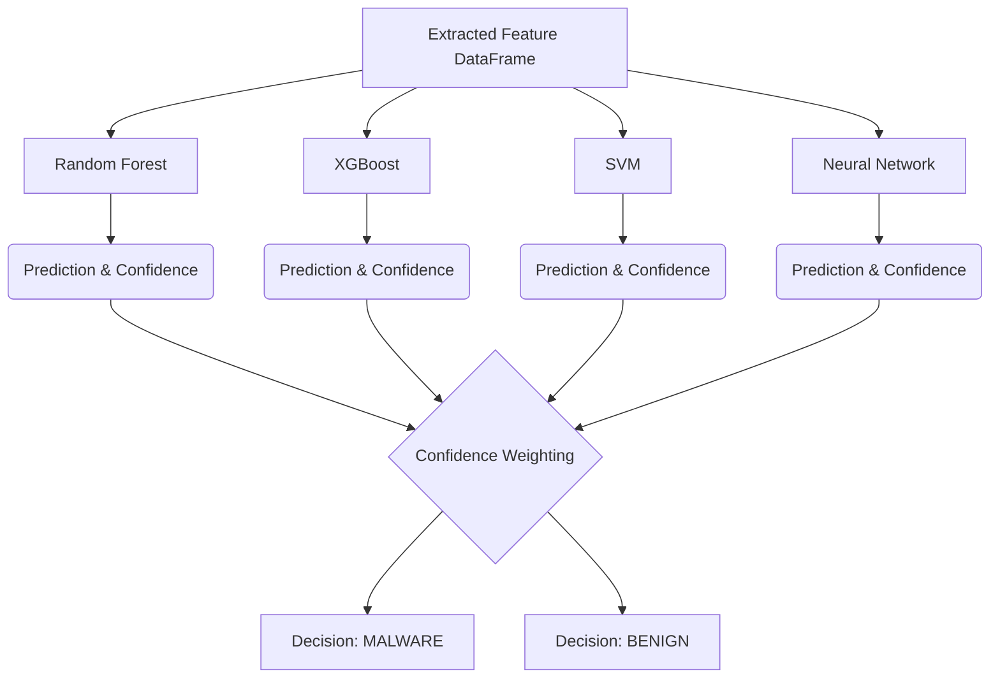

---

## 7. The Visual Intelligence Output (Forensic Report)

Once the backend completes the intensive calculations, it compiles the data into a high-level, human-readable forensic dashboard.

### 7.1 Report Rendering Data Flow
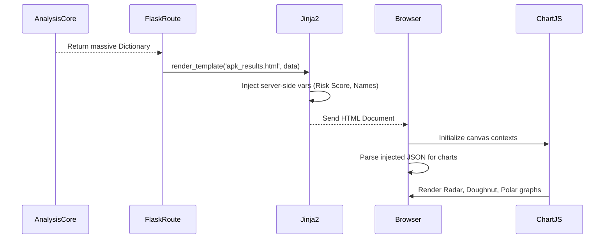

### 7.2 UI/UX Responsive State Machine (Print vs Screen)
The report is designed to transform seamlessly into an official physical document via a Virtual Backend PDF process.

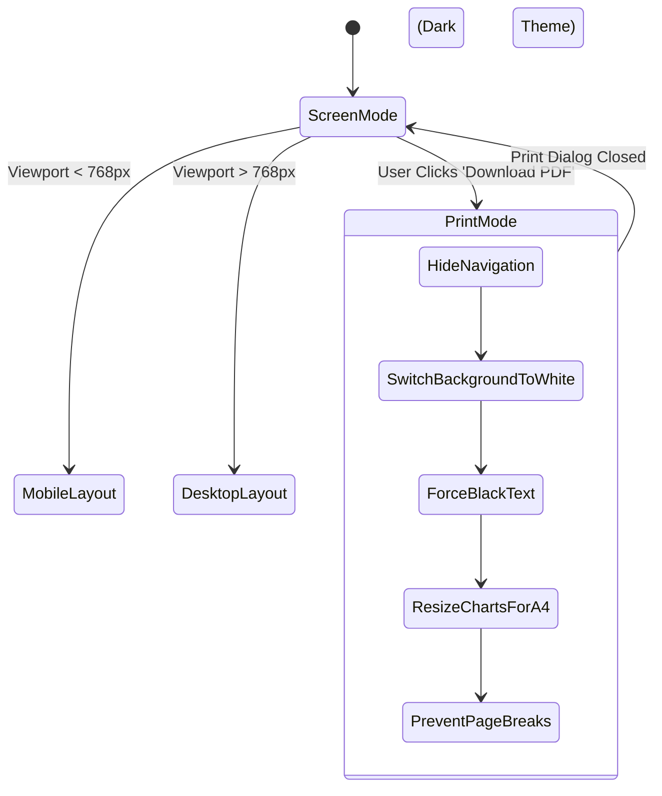

---

## 8. Use Case III: Persistent Security Auditing (History Page)

The platform maintains a permanent ledger of all activities. This allows administrators to track threat trends and review past neural network training iterations.

### 8.1 Dual-Tab History Retrieval Logic
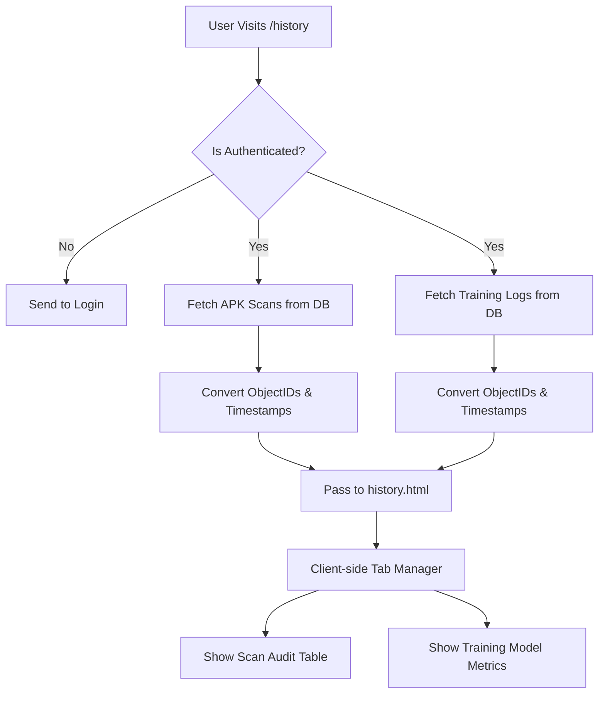

### 8.2 Database Schema Architecture (ERD)
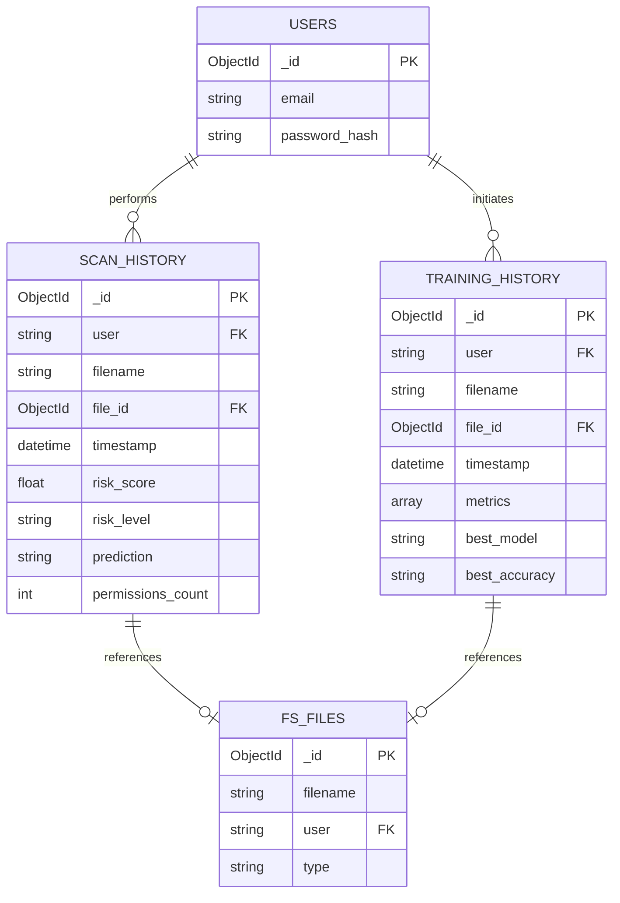

---

## 9. Foundational Components & Infrastructure

### 9.1 Environment & Secrets Management
The platform utilizes a secure `.env` isolation strategy to ensure zero secret leakage into version control.

```mermaid
graph LR
    EnvFile[.env (Ignored by Git)] --> ConfigLoad[dotenv.load_dotenv]
    ConfigLoad --> AppMem[Application Memory]
    
    AppMem --> Key1[FLASK_SECRET_KEY: Session Crypto]
    AppMem --> Key2[MONGODB_URI: Atlas Connection]
```

### 9.2 The Toast Notification Engine
A vanilla JavaScript orchestration system that replaces intrusive alerts with smooth, non-blocking feedback.

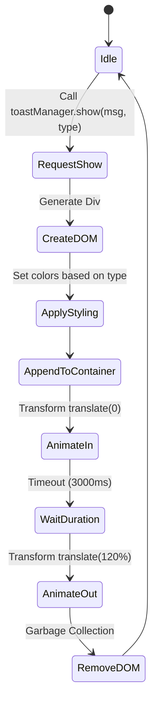

---

## 10. Deployment & Technical Setup Guide

### 10.1 System Prerequisites
*   **OS**: Linux, macOS, or Windows
*   **Engine**: Python 3.8 to 3.11 (Scikit-learn compatibility)
*   **Database**: MongoDB (Local instance or Cloud Atlas cluster)
*   **Memory**: Minimum 4GB RAM (Required for in-memory model inference and APK decompression)

### 10.2 Installation Sequence

1.  **Clone the Repository**
    ```bash
    git clone https://github.com/BlueHeart-Saga/malware-detection.git
    cd malware-detection
    ```

2.  **Establish Secure Environment**
    Create a `.env` file in the root directory:
    ```ini
    FLASK_SECRET_KEY=your_cryptographically_secure_random_string
    MONGODB_URI=mongodb+srv://<username>:<password>@cluster.mongodb.net/?retryWrites=true&w=majority
    ```

3.  **Initialize Virtual Sandbox**
    ```bash
    python -m venv .venv
    source .venv/bin/activate  # On Windows: .venv\Scripts\activate
    ```

4.  **Install Core Dependencies**
    ```bash
    pip install -r requirements.txt
    ```

5.  **Bootstrap the Application**
    ```bash
    python app.py
    ```

### 10.3 Initializing the AI Core
Before running your first APK scan, the system requires a baseline intelligence model.
1. Log into the dashboard.
2. Navigate to the **Model Training** card.
3. Upload a validated CSV dataset containing malware feature vectors.
4. The system will automatically compile the `.pkl` files into the `models/` directory, activating the forensic engine.

---

## 11. Concluding Architectural Statement

MalwareLab represents the intersection of robust web engineering, applied cryptography, and advanced data science. By bridging the gap between raw binary analysis and human-readable interfaces, it establishes a powerful standard for educational cybersecurity platforms and lightweight enterprise forensic tools. The modularity of its design guarantees that as threat vectors evolve, the underlying neural ensemble can be seamlessly retrained and expanded without disrupting the operational pipeline.
